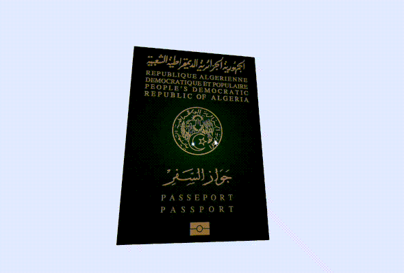

# Algerian Passport 3D Viewer



## 📝 Description

An interactive 3D visualization of the Algerian passport using React Three Fiber. This project uses a detailed GLB model of the Algerian passport, created in Blender, allowing users to explore and interact with the passport in their browser. The GLB format ensures high-quality 3D rendering while maintaining optimal file size and performance.

## Model Details

- Format: GLB (GL Binary)
- Created with: Blender
- Optimized for web performance
- Includes detailed textures and materials of the Algerian passport

## ✨ Features

- High-fidelity 3D model of the Algerian passport
- 360-degree interactive rotation
- Zoom and pan functionality for detailed examination
- Smooth animations
- Real-time rendering with Three.js

## 🚀 Tech Stack

- [React](https://reactjs.org/)
- [Vite](https://vitejs.dev/)
- [Three.js](https://threejs.org/)
- [React Three Fiber](https://docs.pmnd.rs/react-three-fiber/)
- [React Three Drei](https://github.com/pmndrs/drei)

## 🛠️ Installation

1. Clone the repository
```bash
git clone https://github.com/ATHman3/passport_dz_3d
cd passport_dz_3d
```

2. Install dependencies
```bash
npm install
```

3. Start the development server
```bash
npm run dev
```

## 📄 License

This project is licensed under the MIT License. See the [LICENSE](LICENSE) file for details.
